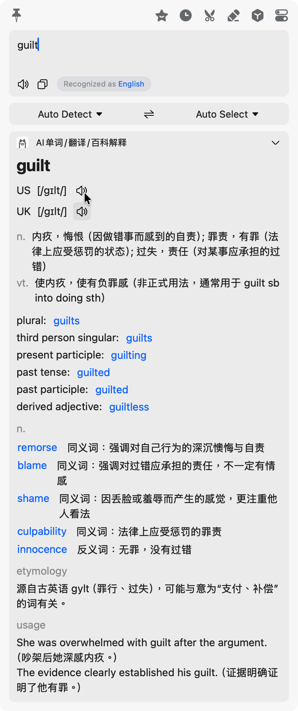
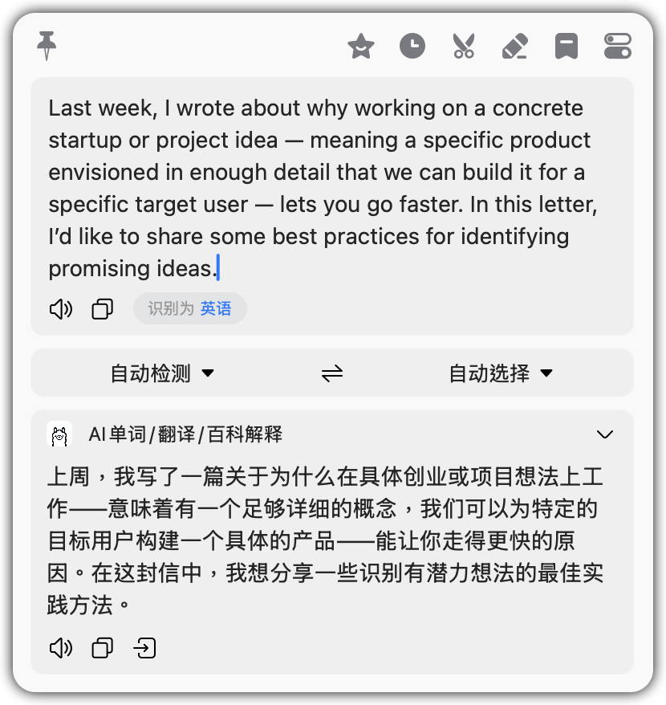
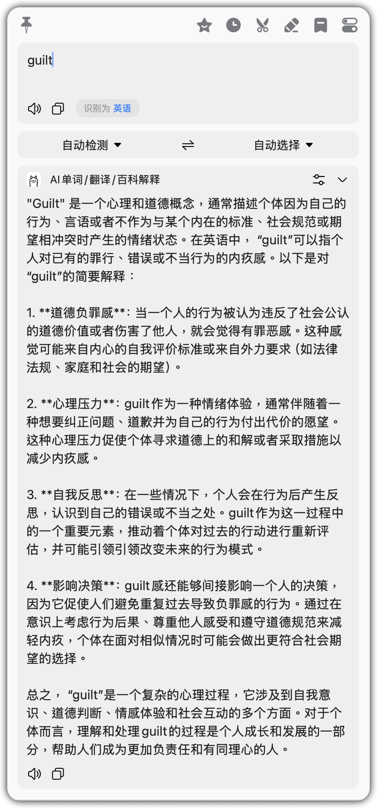
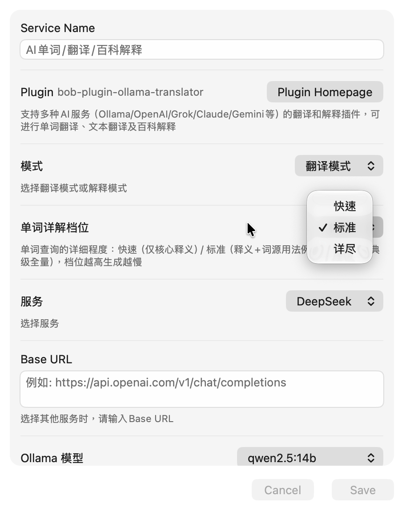

# **[bob-plugin-ollama-translator](https://github.com/CaicoLeung/bob-plugin-ollama-translator)**

为[bob](https://bobtranslate.com/) 编写的翻译插件，支持多种AI服务（Ollama/OpenAI/Grok/Claude/Gemini等）的翻译和解释插件，可进行单词翻译、文本翻译及百科解释（需要bob版本>=1.8.0）

## Bob效果展示

### 翻译模式

1. 如果输入是单词，自动进入学习模式
   

2. 如果是整句，则直接翻译
   

### 解释模式

  

## 支持功能

1. 支持使用api key 使用Ollama/OpenAI/Grok/Claude/Gemini/DeepSeek 等AI服务
2. 支持切换翻译模式和解释模式
3. 自定义Prompt
4. 自定义模型
5. 自定义Base URL
6. 支持thinking mode

## 配置项

  

## 使用Qwen MT 翻译模型

Qwen-MT 是阿里云推出的专业机器翻译模型，基于强大的 Qwen3 模型架构，专门针对多语言翻译任务进行了优化训练。

**官方介绍**: [Qwen-MT：速度与智能翻译的完美融合](https://qwenlm.github.io/zh/blog/qwen-mt/)

### 使用注意事项

#### ⚠️ Prompt 限制

**重要**: 当使用 Qwen MT 翻译模型时，自定义 Prompt 将失效。这是因为 Qwen MT 使用专门的翻译参数来控制翻译行为，而不是通过传统的 Prompt 方式。
